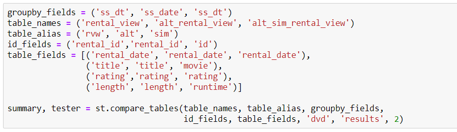
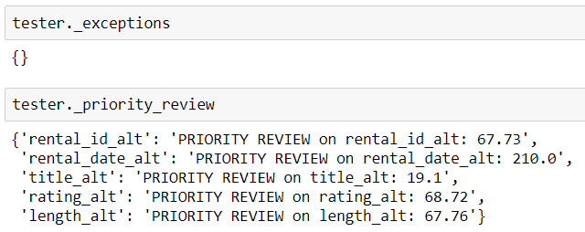

# SQL Analysis

The SQL Analysis module assists in testing of data between SQL database tables. This is the development version of the module.

Use examples include comparing data in a view to those in a table derived from a star schema, or comparing results from a table derived from an external source to a table built via ETL.

## Main Features

- **Class: SQLUnitTest**
    1. Creates and runs SQL database queries based on attributes provided with class instantiation or custom SQL query string.
    2. Completes five built in tests based on field-type categorizations of `count`, `low_distinct`, `high_distinct`, `numeric`, `id_check`.
    3. Flags fields above a specified difference threshold for "priority review".
    4. Displays a summary of results.
    5. Saves results and summary as specified.

- **Function: compare_tables**
    1. Utilizes methods of SQLUnitTest to complete a full comparison of table values.

- **Function: sql_query**
    1. Conducts basic database queries

## Functionality Overview
The concept behind the testing is that database information can often be segmented by a field, such as dates. Testing can be done by comparing field values across these groupings.

If we had three tables `rental_view`, `alt_rental_view`, and `alt_sim_rental_view` we may wish to compare them to see if the "alt" tables are accurately capturing the information in `rental_view`.

### Basic Query
We could view the tables:

**rental_view**

  

**alt_rental_view**

  

**alt_sim_rental_view**

  

### Run Test Battery
And run tests on them:

To complete the test battery we need to determine the fields that can segment the data. In this case, the field that can be used to group the data is `ss_dt` for `rental_view` and `alt_sim_rental_view`, and `ss_date` for `alt_rental_view`.

Table information is specified on instantiation and `compare_tables` will create all query strings, gather the data, and run the tests based on the information provided. (Methods are available via SQLUnitTest to complete each step separately)

**Setup Code**

  

Activity, exceptions, and fields flagged for priority review are logged during operation.

**Log Print-out**

  

**Log Storage**

  

A summarized version of results (as a DataFrame or image), indicating the percentage difference between table fields (and the test type used), is also available via the test battery.

**Visual Summary**

  

## Setup
The files `sql_secrets.py` and `sql_config.py` provide examples of how the SQLAlchemy engines can be configured. These files should be customized for personal use.

## Dependencies
This module utilizes:
- [SQLAlchemy](https://www.sqlalchemy.org/)
- [pandas](https://pandas.pydata.org/)
- [NumPy](https://numpy.org/)
- [Matplotlib](https://matplotlib.org/)
- [Seaborn](https://seaborn.pydata.org/)

## Acknowledgements
Testing is completed using the [PostgreSQL DVD Rental](http://www.postgresqltutorial.com/postgresql-sample-database/) sample database.
