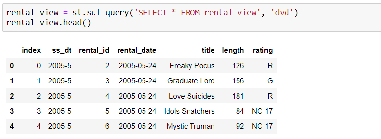
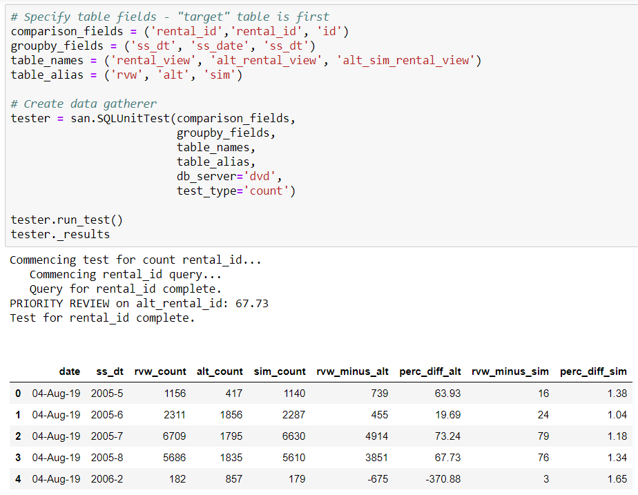

# SQL Analysis

The SQL Analysis module assists in testing of data between SQL database tables. This is the development version of the module.

Use examples include comparing results in a view table to those derived from a star schema, or comparing results from a table derived from an external source to a table built via ETL.

## Main Features

**SQLGatherData** allows generation of SQL query strings and gathering of data to complete one of five different tests `count`, `low_distinct`, `high_distinct`, `numeric`, and `id_check`. It also allows for use of custom query strings.

1. **SQLUnitTest**
    1. Creates and runs SQL database queries based on attributes provided with class instantiation.
    2. Completes five built in tests based on field-type categorizations of `count`, `low_distinct`, `high_distinct`, `numeric`, `id_check`.
    3. Flags fields above a specified difference threshold for "priority review".
    4. Displays a summary of results.

2. Basic database queries can also be completed via the use of **sql_query**.

## Functionality Overview
The concept behind the testing is that database information can often be segmented by a field, such as dates. Testing can be done by comparing field values across these groupings.

If we had three tables `rental_view`, `alt_rental_view`, and `alt_sim_rental_view` we may wish to compare them to see if the "alt" tables are accurately capturing the information in `rental_view`.

We could view each table:

**rental_view**

  

**alt_rental_view**

  

**alt_sim_rental_view**

  

In this case, the field that can be used to group the data is `ss_dt` for `rental_view` and `alt_sim_rental_view`, and `ss_date` for `alt_rental_view`.

Table information can be specified on instantiation and the `run_test` method will create the SQL query string, complete the query, and compare the results. (Methods are available to complete each step separately) This can be done for an individual test.

  

Or for multiple tests and combined and summarized. (Blank cells indicate no difference between fields)

  

## Setup
The files `sql_secrets.py` and `sql_config.py` provide examples of how the SQLAlchemy engines can be configured. These files should be customized for personal use.

## Dependencies
This module utilizes:
- [SQLAlchemy](https://www.sqlalchemy.org/)
- [pandas](https://pandas.pydata.org/)
- [NumPy](https://numpy.org/)
- [Matplotlib](https://matplotlib.org/)
- [Seaborn](https://seaborn.pydata.org/)

## Acknowledgements
Testing is completed using the [PostgreSQL DVD Rental](http://www.postgresqltutorial.com/postgresql-sample-database/) sample database.
